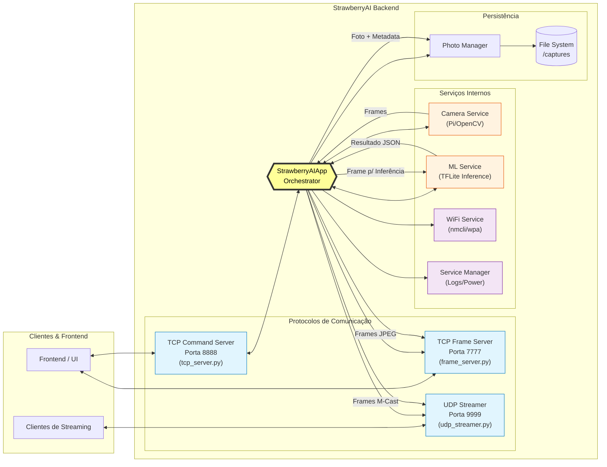

# StrawberryAI - Backend

## 📋 Visão Geral
O **StrawberryAI Backend** é o núcleo do sistema de classificação de morangos em tempo real, responsável por captura de imagens, inferência de aprendizado de máquina, gerenciamento de serviços, streaming de vídeo e comunicação com o frontend. Este módulo foi projetado para execução em Raspberry Pi com câmera CSI, mas também suporta câmeras USB via OpenCV em outras plataformas.

## ✨ Funcionalidades Principais
* **Captura de Imagens:** Suporte para câmera CSI (Raspberry Pi) via Picamera2 e câmeras USB via OpenCV
* **Inferência em Tempo Real:** Classificação de morangos usando modelos TFLite otimizados
* **Streaming de Vídeo:** Transmissão via TCP (frame server) e UDP (multicast)
* **Gerenciamento de Fotos:** Armazenamento organizado com metadados de inferência
* **Conexão Wi-Fi:** Gerenciamento robusto de conexões de rede
* **Controle do Sistema:** Reinicialização de serviços, logs e desligamento
* **Protocolo de Comando:** Comunicação TCP para controle remoto
* **Logs Abrangentes:** Sistema de logging multiplataforma

## 🛠️ Requisitos

### Hardware
* Raspberry Pi 3/4/5 (recomendado)
* Câmera CSI Raspberry Pi ou câmera USB compatível
* 2GB+ RAM
* Armazenamento: 8GB+ (SD card ou SSD)

### Software
* Python: 3.8 ou superior
* Sistema Operacional: Raspberry Pi OS (64-bit recomendado), Ubuntu 20.04+, ou Windows 10+ para desenvolvimento

### Dependências Python
Principais bibliotecas:
* `opencv-python >= 4.8.0`
* `numpy >= 1.24.0`
* `picamera2` (apenas Raspberry Pi)
* `tflite-runtime` ou `tensorflow-lite`

## 📥 Instalação

### 1. Clone o repositório
```bash
git clone [https://github.com/seu-usuario/strawberry-ai.git](https://github.com/seu-usuario/strawberry-ai.git)
cd strawberry-ai/backend

```

### 2. Instale as dependências

```bash
pip install -r requirements.txt

```

### 3. Configuração da Câmera (Raspberry Pi)

```bash
# Habilite a câmera CSI
sudo raspi-config
# Vá para Interface Options > Camera e habilite

# Reinicie o sistema
sudo reboot

```

### 4. Configuração de Permissões

```bash
# Adicione o usuário ao grupo video (Linux)
sudo usermod -a -G video $USER

# Para Raspberry Pi, também ao grupo gpio
sudo usermod -a -G gpio $USER

```

## ⚙️ Configuração

### Arquivo de Configuração (`config.json`)

Localizado em `backend/config/config.json`:

```json
{
  "camera": {
    "type": "pi_camera",  // "pi_camera" ou "opencv"
    "resolution": [1920, 1080],
    "fps": 30,
    "rotation": 0
  },
  "ml": {
    "model_path": "models/strawberry_model.tflite",
    "labels_path": "models/labels.json",
    "threshold": 0.7
  },
  "network": {
    "tcp_port": 8888,
    "udp_port": 9999,
    "frame_server_port": 7777
  },
  "storage": {
    "photos_dir": "captures",
    "max_photos": 1000
  }
}

```

### Variáveis de Ambiente (Opcional)

Crie um arquivo `.env` na raiz do backend:

```text
LOG_LEVEL=INFO
CAMERA_TYPE=pi_camera
MODEL_PATH=models/strawberry_model_v2.tflite

```

## 🚀 Uso

### Iniciar o Backend

```bash
# Modo padrão
python main.py

# Com logging detalhado
python main.py --log-level DEBUG

# Usando configuração personalizada
python main.py --config custom_config.json

```

### Comandos via TCP

O backend aceita comandos via conexão TCP na porta configurada (padrão: 8888):

```bash
# Exemplo usando netcat
echo 'CAPTURE' | nc localhost 8888

```

**Comandos disponíveis:**

* `CAPTURE` - Captura foto e executa inferência
* `GET_INFO` - Retorna informações do sistema
* `WIFI_CONNECT <SSID> <PASSWORD>` - Conecta à rede Wi-Fi
* `RESTART_SERVICE` - Reinicia o serviço backend
* `SHOW_LOGS <lines>` - Retorna logs do sistema
* `SHUTDOWN` - Desliga o sistema de forma segura
* `REGISTER_UDP <client_ip> <client_port>` - Registra cliente para streaming UDP

### Streaming de Vídeo

* **TCP Frame Server:** Conecte-se na porta 7777 para receber frames JPEG
* **UDP Streaming:** Clientes registrados recebem frames via multicast na porta 9999

## 🏗️ Arquitetura

### Estrutura de Diretórios

```text
backend/
├── core/
│   ├── app.py              # Aplicação principal (StrawberryAIApp)
│   ├── config.py           # Gerenciador de configuração
│   └── __init__.py
├── services/
│   ├── camera_service.py   # Serviço de câmera unificado
│   ├── ml_service.py       # Serviço de inferência ML
│   ├── wifi_service.py     # Gerenciamento Wi-Fi
│   ├── system_service.py   # Gerenciador de serviços
│   └── __init__.py
├── protocols/
│   ├── tcp_server.py       # Servidor TCP para comandos
│   ├── udp_streamer.py     # Streaming UDP
│   ├── frame_server.py     # Servidor de frames TCP
│   ├── command_handlers.py # Handlers de comandos
│   └── __init__.py
├── cameras/
│   ├── camera_base.py      # Classe base abstrata
│   ├── pi_camera.py        # Implementação Raspberry Pi
│   ├── opencv_camera.py    # Implementação OpenCV
│   └── __init__.py
├── utils/
│   ├── logger.py           # Sistema de logging
│   ├── photo_manager.py    # Gerenciador de fotos
│   ├── type_helpers.py     # Utilidades para tipos de dados
│   ├── platform_detector.py# Detecção de plataforma
│   └── __init__.py
├── tests/
│   ├── test_camera.py      # Testes de câmera
│   ├── test_streaming.py   # Testes de streaming
│   ├── test_healthcheck.py # Verificação de saúde
│   └── __init__.py
├── config/
│   └── config.json         # Configuração principal
├── models/
│   ├── strawberry_model.tflite # Modelo TFLite
│   └── labels.json         # Labels para classificação
├── captures/               # Fotos capturadas
├── logs/                   # Arquivos de log
├── main.py                 # Ponto de entrada
└── requirements.txt        # Dependências

```

### Diagrama de Componentes


## 🔌 API e Protocolos

### Protocolo TCP de Comandos

**Formato do Comando:**

```text
<COMANDO> [PARÂMETROS]\n

```

**Exemplos:**

```text
CAPTURE\n
GET_INFO\n
WIFI_CONNECT MyNetwork MyPassword123\n
SHOW_LOGS 50\n

```

**Formato da Resposta (JSON):**

```json
{
  "command_id": "CAPTURE_123456",
  "success": true,
  "message": "Foto capturada e classificada",
  "data": {
    "filename": "ripe-0.95-20240115_143022.jpg",
    "classification": "ripe",
    "confidence": 0.95,
    "timestamp": "2024-01-15T14:30:22Z"
  }
}

```

### Formato dos Frames

* **TCP Frame Server:** Envia frames como `[4 bytes tamanho] + [dados JPEG]`
* **UDP Streaming:** Pacotes de até 65000 bytes com header contendo frame ID e offset

## 🔧 Serviços e Módulos

### CameraService

Gerencia diferentes tipos de câmera com interface unificada:

* **pi_camera:** Usa Picamera2 para câmera CSI (Raspberry Pi)
* **opencv_camera:** Usa OpenCV para câmeras USB

**Métodos principais:**

* `start_streaming(fps)`: Inicia streaming contínuo
* `capture_frame()`: Captura frame único
* `get_last_frame()`: Obtém último frame thread-safe
* `save_photo(directory)`: Salva foto atual

### MLService

Executa inferência usando modelos TFLite:

* Carrega modelo e labels dinamicamente
* Pré-processamento idêntico ao treinamento
* Suporte a múltiplas classificações

**Fluxo de Inferência:**

1. Pré-processamento da imagem (redimensionamento, normalização)
2. Execução do modelo TFLite
3. Pós-processamento (softmax, threshold)
4. Tradução de labels (suporte a múltiplos idiomas)

### WiFiService

Gerencia conexões Wi-Fi de forma multiplataforma:

* Usa `nmcli` quando disponível (NetworkManager)
* Fallback para `wpa_supplicant`
* Verificação automática de conexão

### ServiceManager

Controle de serviços do sistema:

* Reinicialização de serviços
* Coleta de logs (backend, frontend, kiosk, métricas)
* Desligamento controlado do sistema

## 🧪 Testes

### Executar Todos os Testes

```bash
python -m pytest tests/ -v

```

### Testes Específicos

**Teste de Câmera:**

```bash
python tests/test_camera.py
# Verifica: dispositivos disponíveis, permissões, funcionamento da libcamera.

```

**Teste de Streaming:**

```bash
python tests/test_streaming.py
# Testa frame server e streaming UDP.

```

**Teste de Saúde:**

```bash
python tests/test_healthcheck.py
# Verifica se o backend está pronto para conexões.

```

**Teste de Serialização:**

```bash
python tests/test_serialization.py
# Garante que dados numpy são serializáveis corretamente para JSON.

```

## 📊 Logs e Monitoramento

### Níveis de Log

* **DEBUG:** Informações detalhadas para desenvolvimento
* **INFO:** Eventos normais do sistema
* **WARNING:** Condições anormais que não são erros
* **ERROR:** Falhas em funcionalidades específicas
* **CRITICAL:** Erros que impedem o funcionamento

### Visualizar Logs

```bash
# Via comando TCP
echo "SHOW_LOGS 100" | nc localhost 8888

# Direto do arquivo
tail -f logs/backend.log

```

## 🔍 Solução de Problemas

### Problemas Comuns

**1. Câmera não detectada (Raspberry Pi)**

```bash
# Execute o diagnóstico
python tests/test_camera.py

# Verifique se a câmera está habilitada
vcgencmd get_camera

# Verifique permissões
ls -la /dev/video*

```

**2. Erro de permissão ao salvar fotos**

```bash
# Garanta permissões de escrita
chmod 755 captures/
sudo chown $USER:$USER captures/

```

**3. Modelo ML não carregado**

* Verifique se o arquivo `.tflite` existe em `models/`
* Confirme que o caminho em `config.json` está correto
* Verifique permissões de leitura do arquivo

**4. Streaming lento ou com lag**

* Reduza a resolução em `config.json`
* Diminua o FPS para 15-20
* Verifique a conexão de rede

### Diagnóstico Avançado

```bash
# Verifique recursos do sistema
top -b -n 1 | grep python

# Monitoramento de rede
sudo netstat -tulpn | grep python

# Uso de memória da câmera
vcgencmd get_mem camera

```
